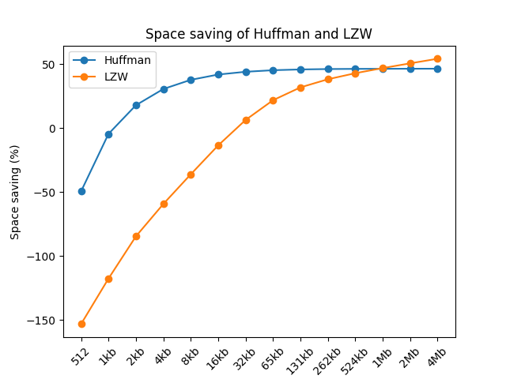

# Implemantation Document

## Project Structure

Application contains four main class: `HuffmanCoding`, `LZWCoding`, `CompressManagement` and `FileManagementService`. `HuffmanCoding` and `LZWCoding` are responsible for compressing and decompressing files. `CompressManagement` is responsible for managing the compression and decompression process. `FileManagementService` is responsible for reading and writing files. The GUI is implemented in `app.py`.

### Huffman Coding

The HuffmanCoding class is responsible for compressing and decompressing files using Huffman coding. The class contains the following steps:

1. Takes a readed file as an input.
2. Creates a frequency table for the file.
3. Uses the frequency table to create a Huffman tree.
4. Creates a dictionary for the Huffman tree.
5. Encodes the file using the dictionary.
6. Writes the encoded file to a new file.
7. Decompression is done in reverse order.

### LZW Coding

The LZWCoding class is responsible for compressing and decompressing files using LZW coding. The class contains the following steps:

1. Takes a readed file as an input.
2. Initializes a dictionary with all possible characters.
3. Encodes the file using the dictionary.
4. Writes the encoded file to a new file.
5. Decompression is done in reverse order.

## Comparison

The comparison is performed using different sizes of files. The files contain lorem ipsum text in different lengths. The files are compressed and decompressed using both algorithms. The compression ratio is calculated using the following formula: `compressed file size / original file size`. The space saving is calculated using the following formula: `1 - (compressed file size / original file size) * 100`. The results are shown in the table below.

| File size | Huffman compression time | Huffman compressed file size | Huffman compression ratio | Huffman space saving | Huffman decompression time | LZW compression time | LZW compressed file size | LZW compression ratio | LZW space saving | LZW decompression time |
| --------- | ------------------------ | ---------------------------- | ------------------------- | -------------------- | -------------------------- | -------------------- | ------------------------ | --------------------- | ---------------- | ---------------------- |
| 512b      | 0.0007s                  | 765b                         | 0.67                      | -49.41%              | 0.0008s                    | 0.00033s             | 1296b                    | 0.40                  | -153.13%         | 0.0003s                |
| 1024b     | 0.0011s                  | 1070b                        | 0.96                      | -4.49%               | 0.0014s                    | 0.00055s             | 2228b                    | 0.46                  | -117.60%         | 0.0003s                |
| 2048b     | 0.0014s                  | 1681b                        | 1.22                      | 17.92%               | 0.0028s                    | 0.0010s              | 3780b                    | 0.54                  | -84.57%          | 0.0006s                |
| 4096b     | 0.0026s                  | 2843b                        | 1.44                      | 30.59%               | 0.0059s                    | 0.0018s              | 6524b                    | 0.63                  | -59.28%          | 0.0012s                |
| 8192b     | 0.0049s                  | 5100b                        | 1.61                      | 37.74%               | 0.011s                     | 0.0033s              | 11148b                   | 0.73                  | -36.08%          | 0.0017s                |
| 16384b    | 0.0096s                  | 9521b                        | 1.72                      | 41.89%               | 0.022s                     | 0.0064s              | 18592b                   | 0.88                  | -13.48%          | 0.0028s                |
| 32768b    | 0.019s                   | 18344b                       | 1.79                      | 44.05%               | 0.044s                     | 0.012s               | 30672b                   | 1.07                  | 6.40%            | 0.0044s                |
| 65536b    | 0.038s                   | 35866b                       | 1.83                      | 45.27%               | 0.088s                     | 0.024s               | 51228b                   | 1.28                  | 21.83%           | 0.0079s                |
| 131072b   | 0.075s                   | 70949b                       | 1.85                      | 45.87%               | 0.179s                     | 0.049s               | 89324b                   | 1.47                  | 31.85%           | 0.014s                 |
| 262144b   | 0.151s                   | 141097b                      | 1.86                      | 46.18%               | 0.356s                     | 0.089s               | 162008b                  | 1.62                  | 38.20%           | 0.024s                 |
| 524288b   | 0.300s                   | 281488b                      | 1.86                      | 46.31%               | 0.703s                     | 0.207s               | 299232b                  | 1.75                  | 42.92%           | 0.050s                 |
| 1048576b  | 0.602s                   | 562226b                      | 1.87                      | 46.38%               | 1.402s                     | 0.436s               | 556516b                  | 1.88                  | 46.93%           | 0.107s                 |
| 2097152b  | 1.190s                   | 1123642b                     | 1.87                      | 46.42%               | 2.796s                     | 0.737s               | 1035168b                 | 2.03                  | 50.63%           | 0.171s                 |
| 4194304b  | 2.349s                   | 2246088b                     | 1.87                      | 46.45%               | 5.504s                     | 1.552s               | 1919708b                 | 2.18                  | 54.23%           | 0.345s                 |

The results show that Huffman coding is more efficient than LZW coding when file size is between 2kb to 1Mb. Compressed Huffman files also includes the Huffman tree, which is used to decompress the file. This means in some cases the compressed file size is larger than the original file size. This is the case when the file size is less than 2kb. LZW compressed files are encoded using unsigned integers, which means the file size has to be larger than 1Mb to be more efficient than Huffman coding.

## Improvements

The Problem with The Huffman encoding is that dictionary for the decoding is included in the compressed file. This means that the compressed file size is larger than the original file size in some cases. When the original file size increases, the space requirement of the dictionary is smaller in relation to the file to be compressed. Also because using python, all the data has to be stored in the file as bytes instead of single or group of bits which are not divisible of eight. This means that the file size is larger than it would be if the file was compressed using a lower level language.

## Sources

- [LZW compression algorithm](https://rosettacode.org/wiki/LZW_compression#Python) - Used as a base for the LZW algorithm implementation.
- [Project Gutenberg](https://www.gutenberg.org) - Books used as a files to test the algorithms.
