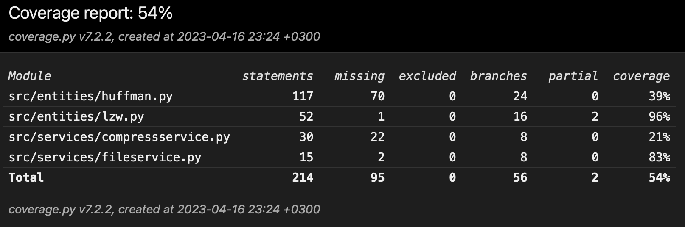

# Testing documentation

This project uses automated unittests to test the functionality of the code.

## Unit tests

The Unit tests are implemented using the unittest module. The tests are located in the `tests` folder. The tests are run using the following command:

```bash
poetry run invoke test
```

Coverage-report is generated using the following command:

```bash
poetry run invoke coverage-report
```

Current coverage:



## Performance tests

The perfomance tests are not implemented yet.
