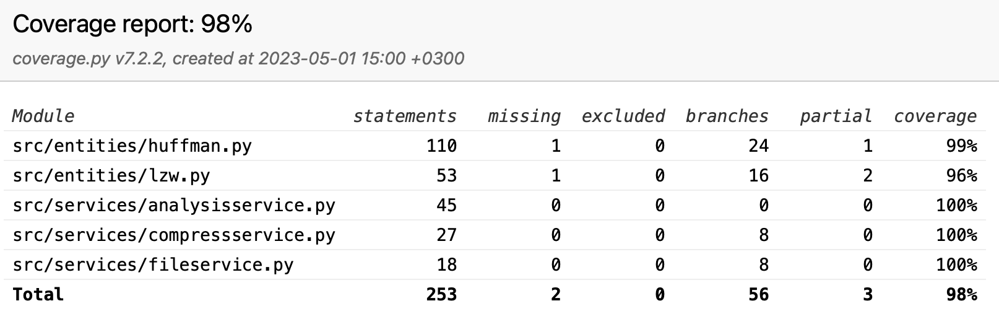

# Testing documentation

This project uses automated unittests to test the functionality of the code. Also application is tested manually to ensure that the application works as intended.

## Unit tests

The Unit tests are implemented using the unittest module. The tests are located in the `tests` folder. The tests are run using the following command:

```bash
poetry run invoke test
```

Coverage-report is generated using the following command:

```bash
poetry run invoke coverage-report
```

Current coverage:



## Performance tests

The performance tests are run by using different files as input and measuring the time it takes to compress and decompress the file and also the size of the compressed file.

### Huffman

| File size | Compression time | Compressed file size | Compression ratio | Space saving | Decompression time |
| --------- | ---------------- | -------------------- | ----------------- | ------------ | ------------------ |
| 512b      | 0.0007s          | 765b                 | 0.67              | -49.41%      | 0.0008s            |
| 1024b     | 0.0011s          | 1070b                | 0.96              | -4.49%       | 0.0014s            |
| 2048b     | 0.0014s          | 1681b                | 1.22              | 17.92%       | 0.0028s            |
| 4096b     | 0.0026s          | 2843b                | 1.44              | 30.59%       | 0.0059s            |
| 8192b     | 0.0049s          | 5100b                | 1.61              | 37.74%       | 0.011s             |
| 16384b    | 0.0096s          | 9521b                | 1.72              | 41.89%       | 0.022s             |
| 32768b    | 0.019s           | 18344b               | 1.79              | 44.05%       | 0.044s             |
| 65536b    | 0.038s           | 35866b               | 1.83              | 45.27%       | 0.088s             |
| 131072b   | 0.075s           | 70949b               | 1.85              | 45.87%       | 0.179s             |
| 262144b   | 0.151s           | 141097b              | 1.86              | 46.18%       | 0.356s             |
| 524288b   | 0.300s           | 281488b              | 1.86              | 46.31%       | 0.703s             |
| 1048576b  | 0.602s           | 562226b              | 1.87              | 46.38%       | 1.402s             |
| 2097152b  | 1.190s           | 1123642b             | 1.87              | 46.42%       | 2.796s             |
| 4194304b  | 2.349s           | 2246088b             | 1.87              | 46.45%       | 5.504s             |

### LZW

| File size | Compression time | Compressed file size | Compression ratio | Space saving | Decompression time |
| --------- | ---------------- | -------------------- | ----------------- | ------------ | ------------------ |
| 512b      | 0.00033s         | 1296b                | 0.40              | -153.13%     | 0.0003s            |
| 1024b     | 0.00055s         | 2228b                | 0.46              | -117.60%     | 0.0003s            |
| 2048b     | 0.0010s          | 3780b                | 0.54              | -84.57%      | 0.0006s            |
| 4096b     | 0.0018s          | 6524b                | 0.63              | -59.28%      | 0.0012s            |
| 8192b     | 0.0033s          | 11148b               | 0.73              | -36.08%      | 0.0017s            |
| 16384b    | 0.0064s          | 18592b               | 0.88              | -13.48%      | 0.0028s            |
| 32768b    | 0.012s           | 30672b               | 1.07              | 6.40%        | 0.0044s            |
| 65536b    | 0.024s           | 51228b               | 1.28              | 21.83%       | 0.0079s            |
| 131072b   | 0.049s           | 89324b               | 1.47              | 31.85%       | 0.014s             |
| 262144b   | 0.089s           | 162008b              | 1.62              | 38.20%       | 0.024s             |
| 524288b   | 0.207s           | 299232b              | 1.75              | 42.92%       | 0.050s             |
| 1048576b  | 0.436s           | 556516b              | 1.88              | 46.93%       | 0.107s             |
| 2097152b  | 0.737s           | 1035168b             | 2.03              | 50.63%       | 0.171s             |
| 4194304b  | 1.552s           | 1919708b             | 2.18              | 54.23%       | 0.345s             |

### Space saving Huffman vs LZW


