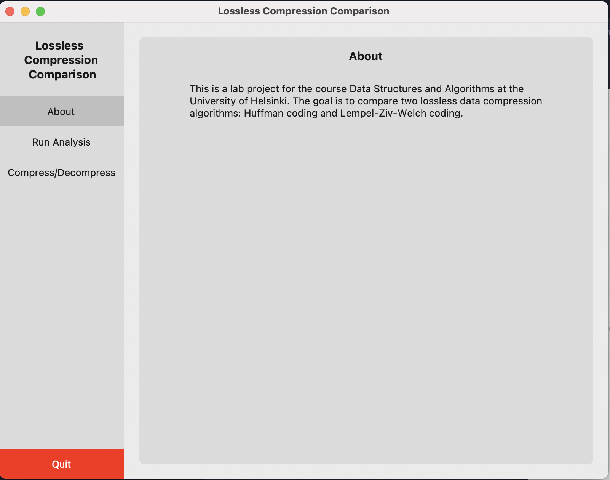
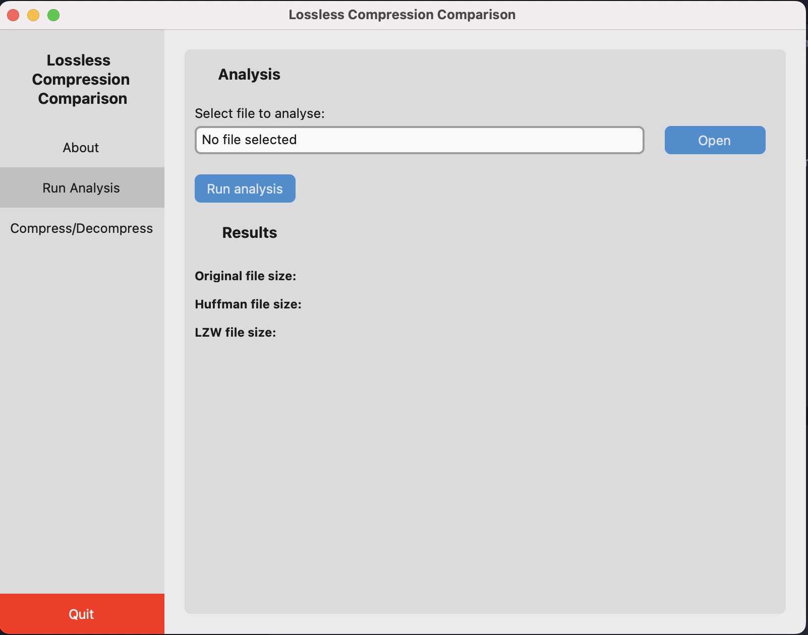

# User guide

## Installation

To install the project and the dependencies run the following command:

```bash
poetry install
```

## Usage

To start the application use the following command:

```bash
poetry run invoke start
```



From the menu on the left you can select the either run analysis or run compression/decompression. The analysis will run both algorithms and compare the results. The compression/decompression will run the selected algorithm on the selected file.



Select .txt file and then click run analysis button. The results will be shown on the screen.


To compress file: 1. Select .txt file 2. Select method 3. Click compress button

To decompress file: 1. Select file to decompress. Application will automatically select the correct method based on the file extension. 2. Click decompress button

To shutdown the application click the Quit button on the bottom of the menu or close the window.
