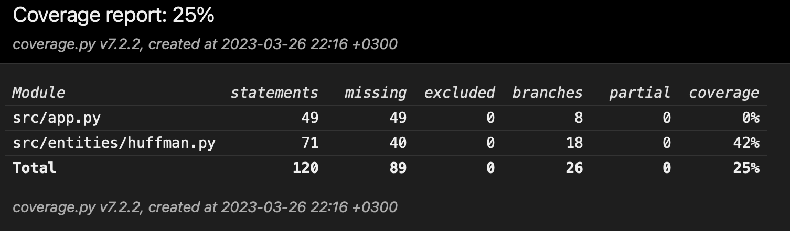

# Week 2

## What I did

- Started working on GUI
- Created Huffman encoding algorithm
- Started implementing unit testing for Huffman encoding algorithm

## Test coverage

## What I learned

- How to use CustomTkinter

## What I will do next

- Finish Huffman encoding/decoding algorithm
- Integrate Huffman encoding/decoding algorithm to GUI
- Improve unit testing for Huffman coding

## Problems

## Time spent

- 10 hours
