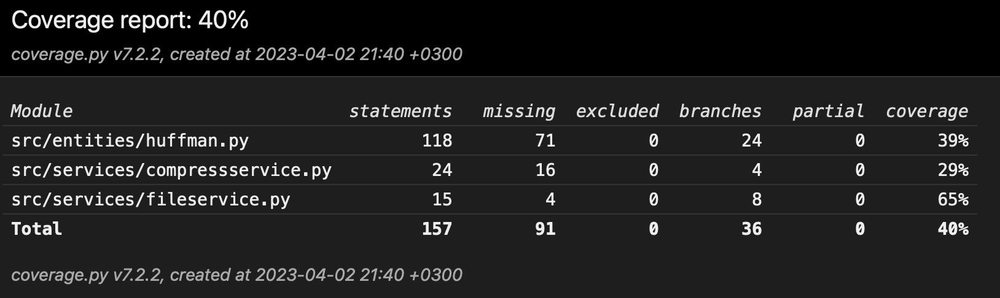

# Week 3

## What I did

- Finished Huffman encoding/decoding algorithm
- Improved GUI (added about and analysis tabs)
- Improved unit testing for Huffman coding
- Started working on testing documentation

## Test coverage

## What I learned

## What I will do next

- Start working on LZW encoding/decoding algorithm
- Improve unit testing for Huffman coding
- Update testing documentation
- Start working on unit testing for LZW coding

## Problems

- I had some problems with unit testing for Huffman coding. I hope I will more insight on this topic after lecture about testing.

## Time spent

- 12 hours
