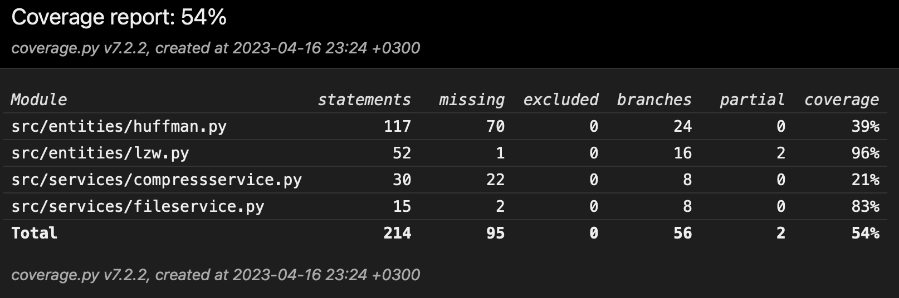

# Week 4

## What I did

- Added LZW encoding/decoding algorithm
- Started working on implementation document
- Started unit testing for LZW coding

## Test coverage

## What I learned

- I learned more about LZW algorithm and how it works

## What I will do next

- Improve unit testing for both algorithms
- Start working on comparison of both algorithms
- Implement logging feature

## Problems

## Time spent

- 10 hours
