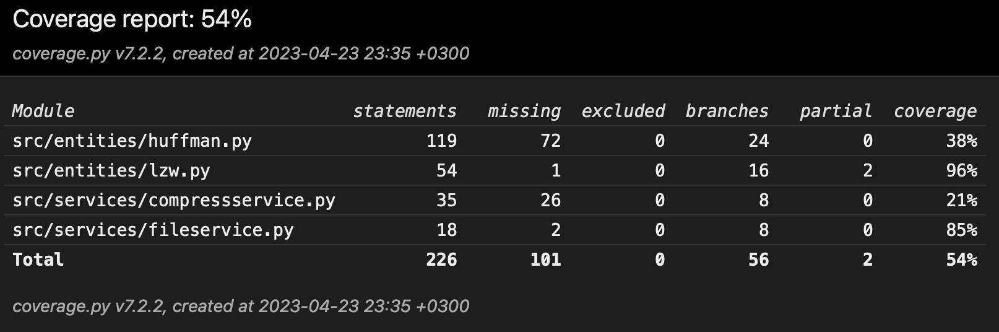

# Week 5

## What I did

- Completed analysis functionality to show compressed file size and compression ratio
- Improved the GUI to show the analysis results

## Test coverage

## What I will do next

- Fix the lzw compression algorithm
- Add more tests
- Improve documentation

## Problems

- Couldn't use as much time for the project as I wanted to
- Currently lzw compression is not working efficiently enough and key error appears with some test data.

## Time spent

- 6 hours
