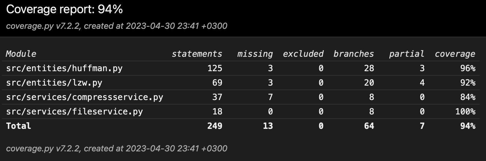

# Week 6

## What I did

- Improved how huffman coding saves the tree to the file and how it reads it back
- Added comments to the code
- Improved unit tests
- Added test coverage

## Test coverage

## What I will do next

- Finish the project

## Problems

## Time spent

- 14h
